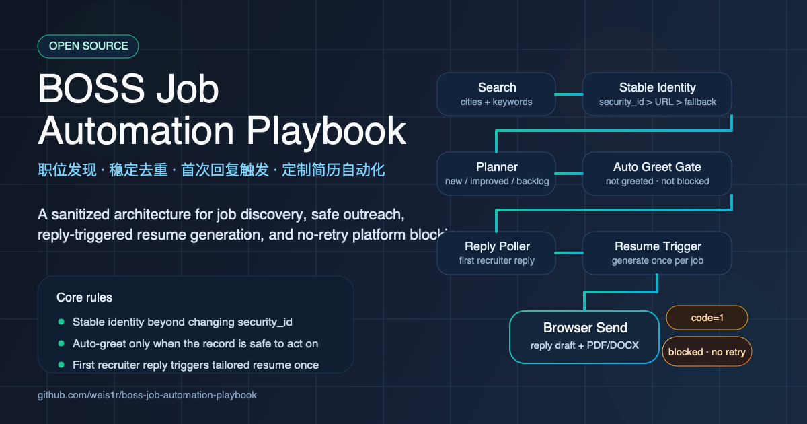
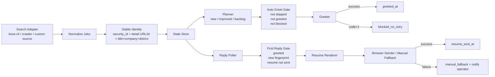
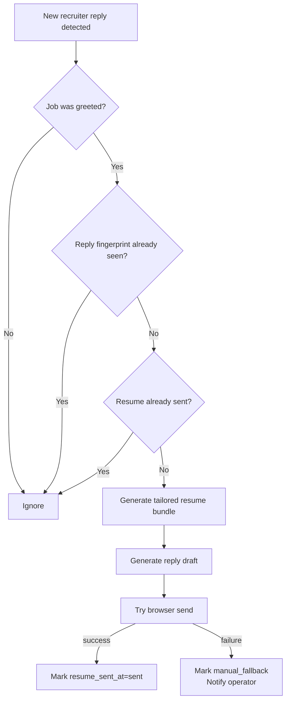

# BOSS Job Automation Playbook



An open-source, sanitized playbook for building a BOSS-style job discovery, outreach, and reply-handling pipeline.

一个开源、脱敏后的 BOSS 风格求职自动化方案，重点覆盖职位发现、去重、自动打招呼规划、招聘方回复处理，以及定制简历触发逻辑。

## Overview | 项目简介

This repository is distilled from a private automation system that was built for a real BOSS-style recruiting workflow. The private version handled search, stable deduplication, auto-greet planning, recruiter reply detection, tailored resume generation triggers, and platform rejection handling.

这个仓库来自一套真实跑过的私有自动化系统，但这里保留的是可公开的核心逻辑，而不是私有环境本身。开源版重点沉淀了：

- stable job identity across changing listing aliases
- multi-keyword polling and queue planning
- safe auto-greet rules
- first-reply resume generation trigger rules
- `code=1` platform rejection blocking and no-retry behavior
- adapter-oriented architecture for search, chat send, and notifications

对应中文可以理解为：

- 解决同一岗位反复换 `security_id` 导致的重复识别问题
- 支持多城市、多关键词轮询后的统一去重和排队
- 把“哪些岗位允许自动打招呼”收敛成明确规则
- 支持“打过招呼后，招聘方首次回复时生成定制简历”的判定
- 对平台拒绝类错误，例如 `code=1`，直接进入“不再重试”状态
- 把平台相关能力抽象成适配器，方便接 `boss-cli`、浏览器自动化、微信/Telegram 等通知渠道

## What This Repo Includes | 仓库包含什么

This repo includes reusable logic and documentation:

- `src/boss_job_automation/`
  - stable identity helpers
  - auto-greet planning rules
  - reply-trigger rules
  - blocked / no-retry state handling
- `docs/`
  - architecture notes
  - workflow notes
  - diagrams
- `examples/`
  - sample config
  - sample candidate profile
- `tests/`
  - critical rule coverage

这个仓库不包含任何私有资产：

- no personal resume content
- no WeChat account IDs
- no OpenClaw live state
- no browser cookies or login state
- no absolute paths from the original machine
- no private runtime logs or delivery routes

## Why Open Source | 为什么适合开源

The most reusable part of this kind of automation is not the private integrations. It is the decision logic:

- how to decide a job is truly new
- how to stop duplicate greetings
- how to detect first recruiter reply safely
- how to avoid repeated resume sends
- how to block and audit platform-rejected actions

这类项目真正有通用价值的，不是微信账号、浏览器 cookie 或个人简历，而是中间那套“决策层规则”。这个仓库就是把这层逻辑抽出来，方便别人接到自己的私有环境里。

## Architecture | 架构示意



上图表达的是四层结构：

1. Source layer：负责从职位来源拉数据
2. Decision layer：负责稳定 ID、去重、排序、状态判断
3. Action layer：负责打招呼、回复后生成简历、发送附件
4. Delivery layer：负责成功通知和失败兜底

## Recruiter Reply Flow | 招聘方回复后的处理流程



这条链路的核心目标只有两个：

- 对真正的“首次新回复”触发动作
- 避免同一个岗位因为多轮沟通而重复发简历

## Core Rules | 核心规则

### 1. Stable job identity | 稳定岗位主键

A job should not become "new" just because a surface ID changed. The recommended identity priority is:

1. `security_id`
2. canonical job detail URL or detail ID
3. fallback `title + company + district`

同一岗位即使换了 `security_id`、换了抓取入口，甚至不同关键词命中，也不应该重复进入“新岗位”。

### 2. Safe auto-greet gate | 自动打招呼门槛

Auto-greet should only apply when all conditions are true:

- not skipped
- not already greeted
- not platform blocked

在代码里，这一层规则收敛成 `can_auto_greet()`。

### 3. First-reply-only resume send | 只在首次回复时触发简历动作

Resume generation or auto-send should only happen if:

- the job has already been greeted
- the reply fingerprint is new
- the resume has not already been sent

也就是说，“有人说话就处理”并不等于“每说一句都再发一次简历”。正确做法是只在满足条件的首次新回复时触发一次。

### 4. Platform rejection no-retry | 平台拒绝后不再重试

If a greet action fails with platform rejection such as `code=1`, the record should be marked blocked and excluded from future auto-greet plans.

如果平台已经明确拒绝，例如 `开聊提醒 (code=1)`，继续撞接口只会重复失败，所以应该进入：

- `greet_blocked_at`
- `greet_blocked_code`
- `greet_blocked_reason`
- `greet_blocked_error`

后续自动计划里直接排除。

## State Model | 状态字段

Recommended persistent fields:

- `stable_id`
- `security_id`
- `canonical_source_url`
- `first_seen_at`
- `last_seen_at`
- `greeted_at`
- `greet_blocked_at`
- `greet_blocked_code`
- `reply_last_fingerprint`
- `resume_sent_at`
- `resume_send_status`
- `resume_send_error`

这些字段本质上把岗位从“发现”到“首次沟通”再到“回复处理”的状态串起来，避免系统靠临时内存判断。

## Repository Structure | 目录结构

```text
boss-job-automation-playbook/
├── README.md
├── docs/
│   ├── architecture.md
│   ├── diagrams.md
│   └── workflows.md
├── examples/
│   ├── candidate_profile.example.md
│   └── config.example.json
├── src/
│   └── boss_job_automation/
│       ├── __init__.py
│       ├── dedupe.py
│       ├── models.py
│       ├── planner.py
│       ├── rules.py
│       └── state.py
└── tests/
    └── test_rules.py
```

## Quick Start | 快速开始

### Option A: run tests directly | 直接跑测试

```bash
python3 -m pip install pytest
PYTHONPATH=src python3 -m pytest
```

### Option B: use it as a reference package | 作为参考包接入

```python
from boss_job_automation.models import JobRecord, ReplyEvent
from boss_job_automation.rules import can_auto_greet, should_generate_resume_on_reply
```

## Example Usage | 使用示例

```python
from boss_job_automation.models import JobRecord, ReplyEvent
from boss_job_automation.rules import can_auto_greet, should_generate_resume_on_reply

job = JobRecord(
    stable_id="job-123",
    title="AI Test Engineer",
    company="Example AI",
    greeted_at="2026-03-28T10:00:00+08:00",
)

reply = ReplyEvent(
    fingerprint="reply-001",
    recruiter_message="Can you send me your resume?",
    trigger="any_reply",
)

if can_auto_greet(job):
    print("eligible for greet")

if should_generate_resume_on_reply(job, reply):
    print("generate tailored resume bundle")
```

## How To Extend It Privately | 如何在私有环境中扩展

This repo is meant to be the decision core. In a real private deployment, you usually add:

- `SearchAdapter`
  - wraps `boss-cli`, API calls, or scraping
- `ChatSender`
  - Playwright or Camoufox based message + file upload flow
- `ResumeRenderer`
  - renders PDF / DOCX per job
- `Notifier`
  - WeChat / Telegram / email / Slack
- `StateStore`
  - JSON, SQLite, Postgres, or Redis-backed persistence

推荐做法是把“规则”和“平台实现”分开：

- 开源层保留规则
- 私有层接具体账号、通知渠道、简历文件和浏览器登录态

## Safety Notes | 安全与边界

- Do not publish real cookies or login sessions.
- Do not publish personal resumes or recruiter chats.
- Do not automate outreach blindly without rate limits and audit logs.
- Always keep a manual fallback path for browser-send failures.

中文建议：

- 不要把真实 cookie、聊天记录、简历正文直接放进开源仓库
- 不要让自动发送链路在失败时静默吞掉结果
- 不要在没有速率控制和审计日志的前提下无限自动打招呼

## Current Scope | 当前开源范围

Included:

- rule engine
- state model
- planning logic
- tests
- sample config
- documentation

Not included:

- real `boss-cli` adapter
- real browser sender
- real resume renderer
- real notification route

## Docs | 文档

- [Architecture](docs/architecture.md)
- [Workflows](docs/workflows.md)
- [Diagrams](docs/diagrams.md)

## Roadmap | 后续可扩展方向

- add a real `boss-cli` search adapter interface
- add browser sender adapter skeletons
- add JSONL runtime log schema
- add state migration helpers
- add GitHub Actions for tests and lint
- add Chinese and English API docs

## License | 协议

MIT
