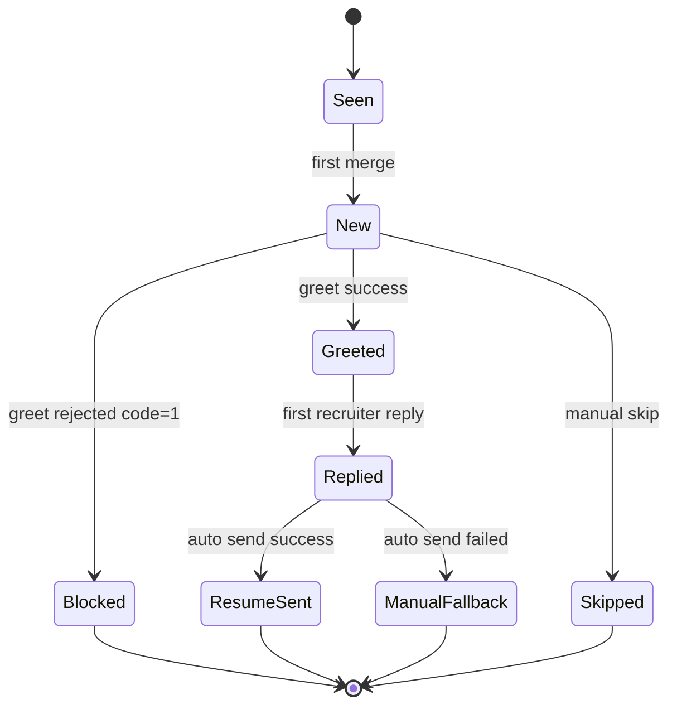
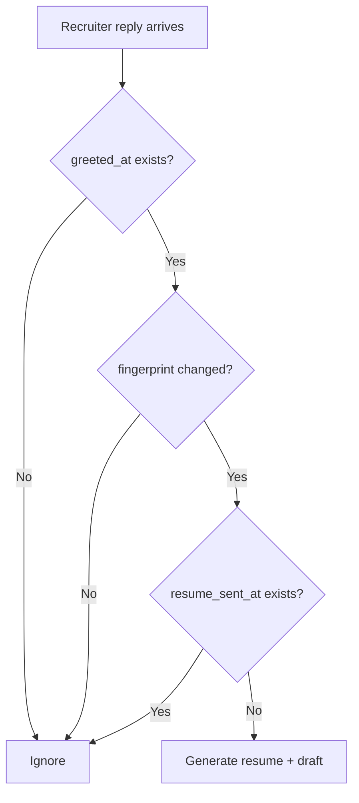

# Diagrams

This page collects the visual diagrams used by the repository.

本页集中存放仓库里的示意图，方便单独引用或后续补充。

## System Architecture | 系统架构

```mermaid
flowchart LR
    A["Job Source"] --> B["Normalizer"]
    B --> C["Stable Identity Builder"]
    C --> D["State Store"]
    D --> E["Scoring + Planner"]
    E --> F["Auto Greet Gate"]
    F --> G["Greeting Action"]
    G --> H["Reply Watcher"]
    H --> I["Reply Trigger Gate"]
    I --> J["Tailored Resume Bundle"]
    J --> K["Browser Sender"]
    K --> L["Success State / Fallback Notify"]
```

## Job Lifecycle | 岗位生命周期

## First Reply Decision | 首次回复判定

